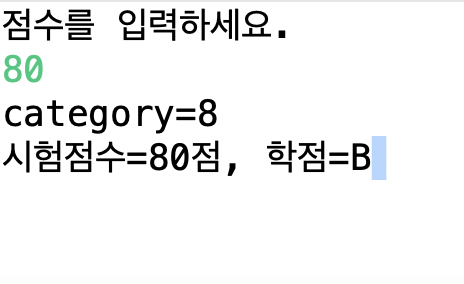

# Java

## Scanner class

### Scanner 를 이용한 학점 계산기

```java
import java.util.Scanner;

public class ScoreTest1 {

	public static void main(String[] args) {
	int score=189;
	int category=0;
	char credit;
	Scanner sc = new Scanner(System.in);

	System.out.println("점수를 입력하세요.");
	 score = sc.nextInt();
	if((score >=0) && (score<=100)) {
		category=score/10;
		System.out.println("category=" +category);

		if(category==10 || category==9)
			credit='A';
		else if(category==8)
			credit='B';
		else if(category==7)
			credit='C';
		else if(category==6)
			credit='D';
		else
			credit='F';
		System.out.println("시험점수=" + score + "점, 학점="+credit);
	} else {
		System.out.println("시험점수가 잘못입력 되었습니다");
	}
	}

}

```

### 출력


