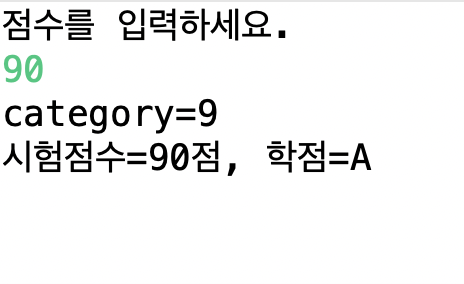

## Scanner class

### Do while 문을 활용한 학점 계산기

```java
import java.util.Scanner;

public class ScoreTest2 {

	public static void main(String[] args) {
		Scanner sc = new Scanner(System.in);
		int[] scores = new int[5];
		int sum = 0;
		int i = 0;
		do {
			System.out.println("점수를 입력하세요.");
			scores[i] = sc.nextInt();
			sum += scores[i];
			i++;
		} while (i < 5);
		double average = (double) sum / 5;
		System.out.println("평균점수는 " + average + "점입니다.");

		int category = (int)average / 10;
		char credit;
		if(category==10 || category==9) {
			credit='A';
		}else if(category==8) {
			credit='B';
		}else if(category==7) {
			credit='C';
		}else if(category==6) {
			credit='D';
		}else {
			credit='F';
		}
		System.out.println("평균점수는 " + average + "점, 학점은 " + credit + "입니다.");
	}

}

```

### 출력


