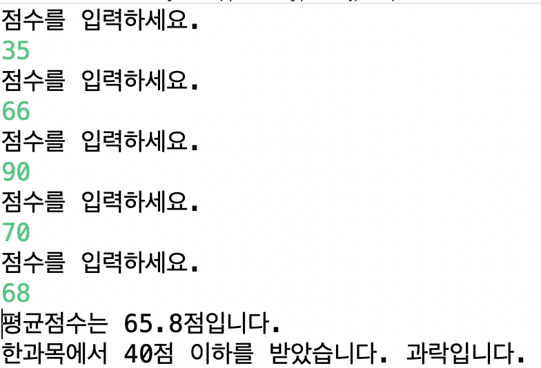

## Scanner class

### Boolean 값 활용한 과락 계산기

```java


import java.util.Scanner;

public class Boolean {

	public static void main(String[] args) {

			Scanner sc = new Scanner(System.in);
			int[] scores = new int[5];
			int sum = 0;
			boolean fail = false;
			for(int i = 0; i < 5; i++) {
				System.out.println("점수를 입력하세요.");
				scores[i] = sc.nextInt();
				sum += scores[i];
				if(scores[i] <ㅔ 40) {
					fail = true;
				}
			}
			double average = (double) sum / 5;
			System.out.println("평균점수는 " + average + "점입니다.");

			int category = (int)average / 10;
			char credit;
			if(category==10 || category==9) {
				credit='A';
			}else if(category==8) {
				credit='B';
			}else if(category==7) {
				credit='C';
			}else if(category==6) {
				credit='D';
			}else {
				credit='F';
			}
			if(fail) {
				System.out.println("한과목에서 40점 이하를 받았습니다. 과락입니다.");
			} else {
				System.out.println("평균점수는 " + average + "점, 학점은 " + credit + "입니다.");
			}
		}


	}

```

### 출력


